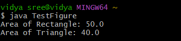

# java-lab-cse-g-5ef-4c
# EXPERIMENT - 4C
# CONSTRUCTION OF ABSTRACT CLASS 
source code 
java 
```

abstract class Figure {
    double d1, d2;
    Figure(double a, double b) { d1 = a; d2 = b; }
    abstract double area();
}

class Rectangle extends Figure {
    Rectangle(double l, double b) { super(l, b); }
    double area() { return d1 * d2; }
}

class Triangle extends Figure {
    Triangle(double b, double h) { super(b, h); }
    double area() { return 0.5 * d1 * d2; }
}


public class TestFigure {
 public static void main(String[] args) {
 Figure f1 = new Rectangle(10, 5), f2 = new Triangle(10, 8);
 System.out.println("Area of Rectangle: " + f1.area());
System.out.println( "Area of Triangle: " + f2.area());
  }
}
  ```

# OUTPUt : 



